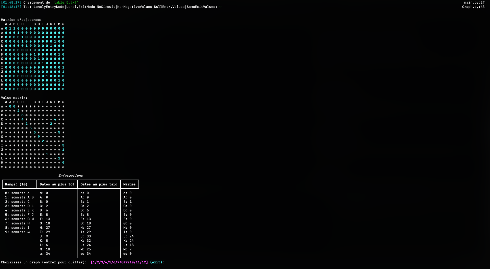

# Projet théorie des graphes

## Romain J., Gaëtan M., Quoc P., Ludovic L., Kilian G.


# Installation:
```sh
$ pip install -r requirements/base.txt
```


# Execution:
```sh
$ python main.py
```


# Traces:
graphe 5


graphe 12
